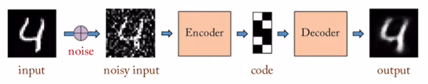

# Auto-Encoder(AE)

- goal: data reconstruction(reconstructed output ≒ input(target))
- features
    - unsupervised learning
    - encoding-decoding structure(bottleneck network design)
    - target = input(input dimension = output dimension)
    - loss function
        - MSE(real values)
        - Cross-entropy(binary values)
- dimensionality reduction: input → latent vector(data compression)
    - latent vector(lower dimension of original input) can be used as an input for other algoritms
    - data visualization
        - high dimension input: X
        - low dimension latent vector: O
    - AE vs PCA  
        
        - PCA: dimensionality reduction using linear plane(hyperplane) 
        - AE: dimensionality reduction using nonlinear manifold
        - performance: AE > PCA(since AE is deep learning and PCA is not, AE's performance is affected by the number of data)
- data-specific
    - strong correlation between input data → better train performance
        - example
            - 1000 pictures of animals < 1000 pictures of cats
    - test data ≒ train data → better test performance
        - example
            - train data: 1000 pictures of cats
            - test data: 100 pictures of cats > 100 pictures of dogs
- lossy: input dimesion > latent vector dimension → inevitable information loss → input quality > output quality 

# Tied weight Auto-Encoder

- definition: decoder = mirror image of encoder
    - transpose of encoder layer weight matrix = decoder layer weight matrix(y=W^T·W·x, originally y=W^-1·W·x)
        - sharing same weight(Tied weight) + dimension transposition(Auto-Encoder) 
- advantage: weight parameter/2(train speed ↑, overfitting ↓)

# Denoising Auto-Encoder

- condition
    - train data: noise-free data
    - test data: noisy data
- definition: use noisy input instead
    - noisy input: original input + random Gaussian noise
    - target: original input(trying to make output without noise)
- advantage: get rid of noise

# Stacked Auto-Encoder(Deep Auto-Encoder)

- definition: stack many one-layer AEs
## Classification(supervised learning)

- step
    - train Stacked AE by unsupervised learning
    - consider only Stacked AE's encoding part and add MLP(FC) on the top of latent vector
    - frozen weight parameter of encoder network(W_1, W_2) and update upper network weight parameter(W_3, W_4) by supervised learning(cannot update all together since W_1, W_2 are trained parameter and W_3, W_4 are not)
    - update W_2, W_3, W_4 by fine-tuning(supervised learning)
## Semi-supervised Learning
- definition: supervised learning with some labeled data and unsupervised learning with mostly unlabled data
- step
    - train Stacked AE with all data by unsupervised learning
    - consider only Stacked AE's encoding part and add MLP(FC) on the top of latent vector
    - frozen weight parameter of encoder network(W_1, W_2) and update upper network weight parameter(W_3, W_4) using only the labled data by supervised learning
## Anomaly detection(unsupervised learning)
- definition: finding outliers(high reconstruction error) without labeled data
    - reconstruction error: error between reconstructed output and target
    - example
        - Stacked AE train: cat pictures
        - input: dog picture
        - reconstruction error: high
        - outlier: yes