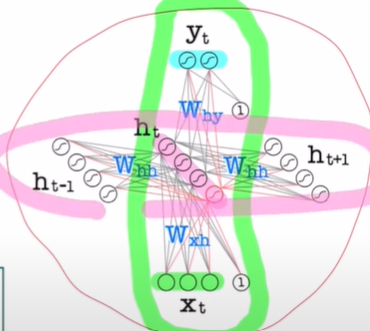

# TDNN(Time Delay Neural Network)
- goal: find temporal patterns with shift-invariance

- network: MLP/FFNN(Feed Forward Neural Network)  
- data: sequential data(x_t, x_t-1, x_t-2, ...)  
- input: [x_t, x_t-1, x_t-2, x_t-3], [x_t-1, x_t-2, x_t-3, x_t-4], ... (sliding a window of size n across sequential data)  
.png)  
- disadvantage:
    - success depends on appropriate window size
        - small window size does not capture
        - large window increases the parameter number and may add unnecessary noise
    - works well for short-memory problems but not for long-memory problems
    - fixed window size cannot handle sequential data of variable length such as language translation
    - FFNNs do not have any memory of past data(only able to capture temporal dependency within the window size)
    - FFNNs treat input data as a multidimensional feature vector rather than sequence of observations(lose the benefit of sequential information)

# RNN(Recurrent Neural Network)
- goal: make predictions based on current input and previous inputs(FFNN makes predictions based on only the current input)

- input: x_t
- prior hidden state: h_t-1(selective memory from previous inputs)
- current hidden state: 
