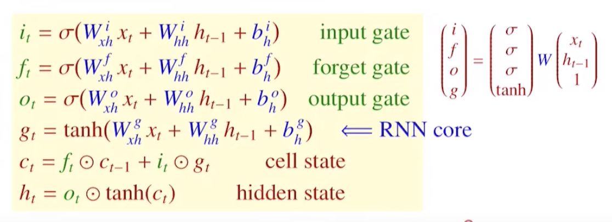

# TDNN(Time Delay Neural Network)
- goal: find temporal patterns with shift-invariance    

- network: MLP/FFNN(Feed Forward Neural Network)  
- data: sequential data(x_t, x_t-1, x_t-2, ...)  
- input: [x_t, x_t-1, x_t-2, x_t-3], [x_t-1, x_t-2, x_t-3, x_t-4], ... (sliding a window of size n across sequential data)  
.png)  
- disadvantages:
    - success depends on appropriate window size
        - small window size does not capture
        - large window increases the parameter number and may add unnecessary noise
    - works well for short-memory problems but not for long-memory problems
    - fixed window size cannot handle sequential data of variable length such as language translation
    - FFNNs do not have any memory of past data(only able to capture temporal dependency within the window size)
    - FFNNs treat input data as a multidimensional feature vector rather than sequence of observations(lose the benefit of sequential information)

# RNN(Recurrent Neural Network)

- goal: make predictions based on current input and previous inputs(FFNN makes predictions based on only the current input)  

- input: 3D tensor with shape (batch_size(number of data for 1 iteration(weight update)), timesteps(of Truncated BPTT), input_dim(of x_t))
- forward propagation
    - input: x_t
    - prior hidden state: h_t-1(selective memory from previous inputs)
    - current hidden state: h_t
        - weights: W_xh, W_hh(shared at every time step)
        - bias: b_h
        - activation function: tanh(-1~1->reflection of past memory)
    - output: y_t
        - weight: W_hy(shared at every time step)
        - bias: b_y
        - activation function: depends  
    
- BPTT(Back Propagation Through Time)
    - goal: update U(W_xh), V(W_hh), W(W_hy)
    - weight update process
        - compute all weights in the unfolded network(U_0, U_1, ... & V_1, v_2, ...)
        - U = Avg/Sum(U_0, U_1, ...), V = Avg/Sum(V_1, v_2, ...)
    
- Truncated BPTT(Truncated Back Propagation Through Time)
    - problems
        - BPTT can be slow when dealing with long sequential data
        - multiplication of gradients over many timesteps can lead to gradient vanishing/exploding problem
    - solution: backpropagation done over each subsequences
    - hyperparameters
        - number of timesteps(lookback)
            - divide long input sequence into overlapping subsequences with same time interval
            - should be long enough to capture relevant past information and should be short enough to train efficiently
            - example
                - batch size: 5
                - timestep: 5
                - initial hidden state
                    - Default mode: random
                    - Stateful mode: stateful = true(better than random)
                        - if previous hidden state exits from other timesteps, use it
                        - should not shuffle within mini-batch(sequence in each mini-batch matters)
                        - no remainder for numbers of total samples/batch size
                        - example
                            - first time step(x_0, x_1, x_2, x_3, x_4) in first mini-batch makes h_4
                            - h_4 is used as an initial hidden state for first time step(x_5, x_6, x_7, x_8, x_9) in second mini-batch
                - weight update: Avg/Sum(Avg/Sum(gradients) of each timesteps) for each mini-batch
                    - can shuffle within mini-batchs(each is independant)
                    - cannot shuffle within timesteps(each is relevant)

# LSTM(Long Short-Term Memory)

- goals
    - capture long-term dependency
    - overcome the vanishing/exploding gradient problem
- problems
    
    - hidden state only cannot solve problems of SimpleRNN
        - if the gap between the relevant information and the point where it is needed becomes large, RNN learning ability will be decreased
        - if the hidden state size is too small, it cannot digest all preceding information(information loss) and if the hidden size is too big, there are too much weight parameters to learn
- solutions
    
    - add cell state
        - cell state sorts out important and unimportant information from the past with every inputs
            - important information to long-term memory(why cell state exists)
            - unimportant information to short-term memory
    - add gates
        - regulate the flow of information into and out of the cell state
        - gates learn from current input and previous hidden state same as RNN(LSTM total weight matrixs = RNN total weight matrixs * 4)
        - gates activation function: σ(Sigmoid)
        - forget gate → input gate → output gate
        - forget gate
            - decide how much of the previous information to forget
        - input gate
            - decide how much new information to put into the cell state
        - output gate
            - decide how much information to extract from the cell state to the hidden state

# Stacked LSTM

- features
    - deep models are generally better than a shallow one
    - typically stacks up to max 3 layers
    - mandatory to set return_sequences = True
        - output shape for each recurrent layer is (batch_size, timesteps, output_dim)
        - if False, output shape(last output) is (batch_size, timesteps, output_dim)

# Dropout in LSTM
- type
    - per-step mask: apply different dropout for each timestep
        - ex) RNN regularization dropout, Recurrent dropout, Zoneout
    - per-sequence mask: apply same dropout for each timestep
        - ex) RNNdrop, Variational RNN dropout, Weight-dropped LSTM, Recurrent dropout

# GRU(Gated Recurrent Unit)

- features
    
    - simplified version of LSTM
        - GRU's hidden state =  LSTM's cell state and hidden state
        - GRU's update gate = LSTM's input gate and forget gate
    - reset and update gates
        - gates learn from current input and previous hidden state same as RNN(LSTM total weight matrixs = RNN total weight matrixs * 3)
        - reset gate
            - capture short-term memory
        - update gate
            - capture long-term memory
        