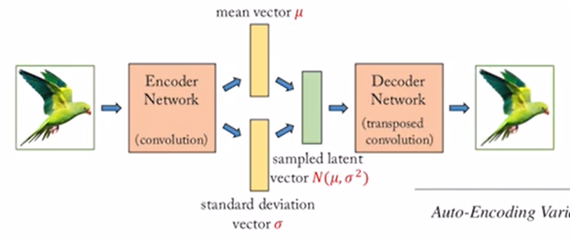
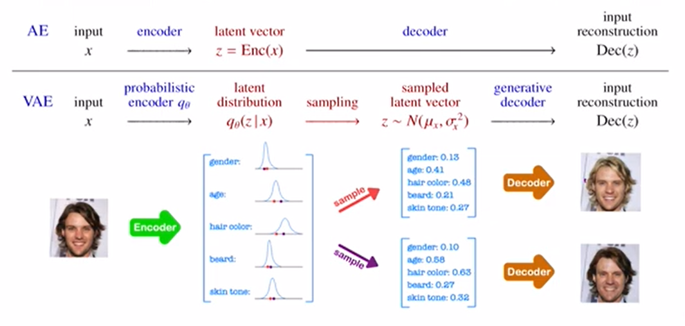
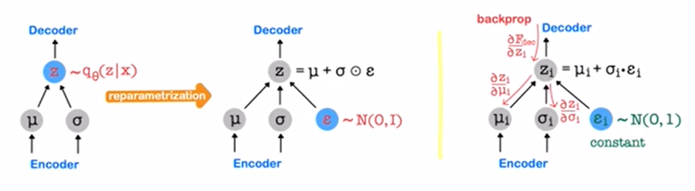

# Variatioinal Auto-Encoder(VAE)

- goal: generating many variations of input(generative model)
    - AE: 1 input → 1 output
    - VAE: 1 input → 100 sampled latent vectors → 100 outputs
- probabilistic encoder: input → mean latent vector μ, standard deviation latent vector σ(Variational inference: N(μ,σ²) approximating intractable posterior p(z|x) of each attribute)
- generative decoder: random sampled (from N(μ,σ²)) latent vector → reconstructed output(input reconstruction)
- reparametrization trick: trick used for backpropagation
    
    - original: random sample from N(μ,σ²) → backpropagation(compute gradients over μ, σ) X
    - trick: random sample from ε ∈ N(0,1) and make a latent vector z = μ + σ⊙ε → backpropagation(compute gradients over μ, σ) O
- loss function: Reconstruction term + β * Regularization term
    - tradeoff
        - β ↑: Regularization term is more important
        - β ↓: Reconstruction term is more important
    - Reconstruction term: minimize reconstruction error as in AE(reconstructed output ≒ input)
    - Regularization term: enforce N(μ,σ²) to be similar to N(0,1)
        - otherwise μ → z, σ → 0 as in AE